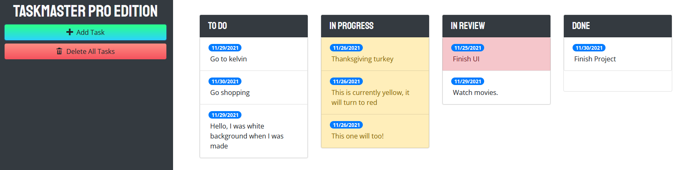

# TaskMaster Pro Edition

## Description
Organize tasks into the designated column by clicking and dragging it over!

## How To Use
To create a task, click the "Add Task" button and fill out the modal
with the task details. Then click "Save Task" and now you can move it to any 
column you desire. 

To delete a task, simply drag it into the trash zone.

All changes are saved whenever any update is made, so you can click out 
of the page or refresh the browser and all of your tasks will remain in the same order you left them!

If a task's due date is less than 2 days away, that task will turn yellow to reflect
it's urgency. If a task is past it's due date, it will turn red.

To edit a task, just click on the date or the task description. Your changes will be
automatically saved.

## Made With
* HTML
* CSS
* JavaScript
* jQuery
* jQuery UI
* jQuery UI Touch Punch
* Moment.js
* Bootstrap

## Website
https://chance-crawford.github.io/TaskMaster/